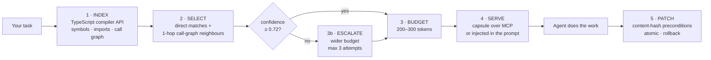

# Verðandi — Context Compiler for AI Coding Agents

[](https://github.com/natureco-official/verdandi/actions/workflows/ci.yml)
[](LICENSE)
[]()
[]()
[]()

**🇹🇷 [Türkçe sürüm](README.tr.md)**

> Your agent doesn't spend most of its budget solving the problem.
> It spends it **looking for the problem**.

**Verðandi** reads your codebase so your agent doesn't have to. It indexes the project with the TypeScript compiler, works out which symbols the task actually touches, and hands the agent a small, bounded capsule of exactly that. The agent skips the hunt and starts on the work.



---

## Lossless evidence and optional Urðr bridge

The new `read_evidence` tool pages exact source text under a named tokenizer budget, keeps immutable references across restarts, and can return an exact delta from `previousRef`. The built-in agent uses these pages with per-request and total reservation budgets. Urðr is optional and explicitly bound to a project memory directory. See [usage, recovery boundaries and measurement](docs/LOSSLESS-CONTEXT.md). These changes have **not** yet established end-to-end model quality parity or a thousand-token task budget.

## The measurement

Nine real tasks, taken from commit pairs in [`modelcontextprotocol/typescript-sdk`](https://github.com/modelcontextprotocol/typescript-sdk). Same model, same effort setting, same tasks. The only difference is whether the agent had to find its own context.

| Task | Baseline | With Verðandi | Change | |
|---|---:|---:|---:|:--|
| T01 | 123,662 | 150,152 | **+21.4%** | `▓▓▓▓▓▓▓▓▓▓▓▓` |
| T07 | 632,596 | 451,486 | **−28.6%** | `▓▓▓▓▓▓▓▓░░░░` |
| T06 | 838,150 | 393,572 | **−53.0%** | `▓▓▓▓▓░░░░░░░` |
| T03 | 660,577 | 308,988 | **−53.2%** | `▓▓▓▓▓░░░░░░░` |
| T05 | 678,465 | 284,876 | **−58.0%** | `▓▓▓▓▓░░░░░░░` |
| T10 | 1,668,854 | 611,438 | **−63.4%** | `▓▓▓▓░░░░░░░░` |
| T02 | 2,197,039 | 569,752 | **−74.1%** | `▓▓▓░░░░░░░░░` |
| T08 | 2,224,703 | 284,683 | **−87.2%** | `▓▓░░░░░░░░░░` |
| T09 | 3,417,767 | 414,962 | **−87.9%** | `▓░░░░░░░░░░░` |
| **Total** | **12,441,813** | **3,469,909** | **−72.1%** | **3.59× less** |

**8,971,904 input tokens saved** across the nine tasks — 3.59× less input for the same work completed. Wall time fell too, between 11% and 55% per task group, but tokens are the number that shows up on the invoice.

> **Why there is no T04.** T04 was measured (1,384,450 → 577,883) but is excluded: both its retry tests turned out to be order-dependent and failed under isolated testing *on both sides*, so neither run proved the fix. The tests were repaired afterwards, and the token numbers predate that repair. Note that this exclusion **flatters us** — T04's −58.3% is below average, so including it would move the headline to −70.7%. It is left out because the result is invalid, not because it is inconvenient.

### T01 is in that table on purpose

T01 costs **21% more** with Verðandi. It's a two-line import-order fix: there is nothing to search for, so the capsule is pure overhead.

That is the whole shape of the result. Verðandi does not make models cheaper — it removes the *searching*. When there is no searching to remove, it removes nothing and charges you for the attempt. When a bug is spread across four files in a large repo, it removes almost all of it.

If your work looks like T01, you don't need this. If it looks like T08 or T09, you very much do.

### What is not proven yet

- **Quality equivalence.** Task tests pass on both sides and every run was independently tested, linted, typechecked and read by hand — the model's own "I verified it" was never accepted as evidence. But a third-party *blind* score comparison is still pending. "No quality loss" is the goal, not a finished measurement.
- **Generality.** Nine tasks, one repository, TypeScript only. T11–T40 and a second independent labeller are still open.

Published because a benchmark that reports only its wins is not a benchmark.

---

## The problem, in one picture

```
WITHOUT VERÐANDI                          WITH VERÐANDI
─────────────────────────────────         ─────────────────────────────────
 "fix the auth retry bug"                  "fix the auth retry bug"
        │                                         │
        ▼                                         ▼
 ┌──────────────────────┐                  ┌──────────────────────┐
 │ ls, grep, cat        │  ← tokens        │ index with the TS    │  ← no model
 │ reads a file… wrong  │  ← tokens        │ compiler API         │     tokens
 │ reads another…       │  ← tokens        └──────────┬───────────┘
 │ searches again…      │  ← tokens                   │
 │ finally finds it     │  ← tokens                   ▼
 └──────────┬───────────┘                  ┌──────────────────────┐
            │                              │ capsule: 3 symbols,  │
            ▼                              │ 2 files, ~250 tokens │
      starts working                       └──────────┬───────────┘
                                                      │
                                                      ▼
                                                starts working
```

That search is invisible on your bill. It just looks like *"the task was expensive"*.

---

## How it works



When confidence stays low after three attempts, Verðandi stops and hands the task to a human instead of spending more budget on guesses.

---

## Quick start

```bash
git clone https://github.com/natureco-official/verdandi.git
cd verdandi
npm install && npm run build && npm test
```

Then pick how you want to use it.

<details>
<summary><b>As an MCP server</b> — seven confirmed agents, plus Antigravity and GLM untested (see the table below)</summary>

```bash
node bin/verdandi-context-compiler setup codex   # prints the registration command
node bin/verdandi-context-compiler status
```

Run `npm start` to start the stdio server directly. Wire compatibility is continuously tested against the pinned official `@modelcontextprotocol/client@2.0.0`, on both the legacy `initialize` and the 2026-07-28 `server/discover` flow.
</details>

<details>
<summary><b>Injected into the prompt</b> — no MCP client needed</summary>

```bash
./run_with_capsule.sh <agent> <project-root> "Your task"
```

Supports every agent in the table below: `natureco`, `hermes`, `codex`, `claude`, `opencode`, `openclaw`, `kimi`, `glm` and `antigravity`.
</details>

<details>
<summary><b>As a standalone agent</b></summary>

```bash
verdandi-agent "Fix the import order" --project ./project --model gpt-4o --api-key "$VERDANDI_API_KEY"
```

Environment: `VERDANDI_API_KEY`, `VERDANDI_MODEL`, `VERDANDI_BASE_URL`, `VERDANDI_REQUEST_TIMEOUT_MS`, `VERDANDI_CODEX_MODEL`. Legacy `URDR_*` names still work.
</details>

---

## Supported agents

Two independent ways to use Verðandi, and not every agent has both. This table is generated from the actual dispatch tables — `AGENTS` in [`bin/verdandi-context-compiler`](bin/verdandi-context-compiler) and the `case` block in [`run_with_capsule.sh`](run_with_capsule.sh) — not from memory.

| Agent | MCP server | Capsule injection | Registration | Config file |
|---|:--:|:--:|---|---|
| **Codex CLI** | ✅ | ✅ | one command | `~/.codex/config.toml` |
| **Claude Code** | ✅ | ✅ | one command | `~/.claude.json` |
| **NatureCo CLI** | ✅ | ✅ | one command | `~/.config/natureco/config.json` |
| **Hermes** | ✅ | ✅ | one command | `~/.hermes/config.json` |
| **OpenCode** | ✅ | ✅ | manual edit | `~/.config/opencode/opencode.jsonc` |
| **OpenClaw** | ✅ | ✅ | manual edit | `~/.openclaw/openclaw.json` |
| **Kimi CLI** | ✅ | ✅ | manual edit | `~/.kimi-code/config.toml` |
| **Antigravity** | ⚠️ | ✅ | unverified | `~/.gemini/antigravity-cli/mcp-config.json` |
| **GLM CLI** | ⚠️ | ✅ | unverified | — |

> **The column is named "capsule injection", not "prompt injection", on purpose.** It means Verðandi
> writes the capsule into the agent's prompt — a feature, not the security term. The security
> question is below.

### Tasks written in another language (optional, off)

Ranking works on shared letters, so a task written in Turkish against code named
in English has nothing to match on: `screenShareManager.ts` and "ekran paylaşımı"
have no letters in common. A semantic layer can bridge that. It is built, and it
is off.

Measured on a 293-file project, 15 tasks per language with the correct file
established by hand, target present in the capsule:

| | lexical only | with semantics |
|---|---:|---:|
| Turkish | 7/15 | **8/15** |
| English | 12/15 | **13/15** |

One task per language. The two are complementary rather than ranked -- on a
subset of eight, each finds three the other misses -- so semantic results are
added beside the lexical ones, never in place of them.

It is off by default, and the dependency is not installed by default either:

```bash
npm install @huggingface/transformers   # ~382 MB, one time
VERDANDI_SEMANTIC=1 npx verdandi-context-compiler
```

**Before you enable it:** the package pulls `onnxruntime-node` and `sharp`, which
carry four high-severity advisories with no fix available (`adm-zip`, and libvips
CVE-2026-33327/33328/35590/35591). `npm audit` fails while it is installed. That
is not a reason nobody should use it, but it is a decision to make deliberately —
it is why the dependency is a peer marked optional and is not in the lockfile.

Enabling it costs more than the table shows. With the package present and the
layer on, the test suite went from 30 to 162 seconds and the first index of a
large project pays for embedding every file (cached afterwards under
`~/.verdandi`, keyed by file content). Weigh it against one task in fifteen.

### Running this on code you do not trust

Verðandi's whole job is to put **raw source from the indexed project** into an agent's prompt. If
that project came from somewhere you do not control — a vendored dependency, a pull request, a
comment in a file — then text inside it reaches the agent verbatim, and an agent cannot tell it
apart from your instructions by construction.

Two things follow:

- `run_with_capsule.sh` no longer passes `--yolo`, `--permission-mode auto` or
  `--dangerously-skip-permissions` by default. Full autonomy is now an explicit choice:
  `VERDANDI_YOLO=1 ./run_with_capsule.sh claude <root> "<task>"`. Without it the agents keep their
  normal permission behaviour, which in a non-interactive run can mean a refused tool call — an
  unfinished task beats one nobody was asked about.
- The embedded source is framed as data, inside delimiters, with an explicit line telling the agent
  that only the `# Görev` section is an instruction.

Neither is a guarantee. Framing helps a model draw the line; it does not force it to. The load is
carried by the default: on an untrusted codebase, run without `VERDANDI_YOLO` so that anything the
agent is talked into still has to get past its own permission gate.

**Read the two imperfect rows before you plan around them:**

- **Antigravity** now has capsule injection: `run_with_capsule.sh antigravity` calls `agy -p "<prompt>"`, adding `--dangerously-skip-permissions` only under `VERDANDI_YOLO=1`. The MCP side is the unverified half — `setup antigravity` prints `antigravity mcp add …`, but the binary is actually `agy`, no official documentation describes an `mcp add` subcommand, and the published config paths (`~/.gemini/config/mcp_config.json`, `.agents/mcp_config.json`) do not match the one this repo declares. Registering by hand is the reliable route until someone verifies it against a real install.
- **GLM** is unverified on the same side: capsule injection works, MCP does not. `setup glm` prints a command prefixed *"If GLM supports MCP:"* and declares no config file, so `status` cannot confirm it either. Treat MCP-on-GLM as untested, not as supported.

> **Antigravity on Windows:** you need **agy ≥ 1.0.15**. Earlier versions exit 0 and silently throw away stdout when run from a pipe or subprocess — which is exactly how this script invokes them — so a broken run looks like the model simply returned nothing ([antigravity-cli#76](https://github.com/google-antigravity/antigravity-cli/issues/76)). The script checks the version and warns before you lose an afternoon to it.

`setup <agent>` prints the registration command rather than editing your config itself — you see the change before it happens. `status` then reports what is actually registered.

> **Where the −72% was measured:** every benchmark run used **Codex CLI** (`gpt-5.6-sol`, medium effort). The mechanism is agent-independent — the capsule is just a smaller prompt — but the savings have only been *measured* on one agent. Expect the same shape elsewhere; don't expect the same digits.

---

## The six tools

| Tool | What it does | Why it is safe |
|---|---|---|
| `context_capsule` | Picks the symbols and files for a task | Read-only, budget-bounded |
| `read_symbol` | Returns a symbol's source and hashes | Read-only, project-scoped |
| `read_evidence` | Lossless token-bounded source pages and hash-checked deltas | Project-scoped; writes a derived evidence cache |
| `apply_structured_patch` | Applies an edit | Refuses if the file changed since the snapshot |
| `rollback_patch` | Undoes a patch | Only inside the project, only if untouched since |
| `validate_delta` | Runs project scripts | Only with explicit `commandProfile: "package-scripts"` |

---

## Safety

This tool reads your source, writes patches and can run your package scripts. That deserves more than a promise, so every guarantee has a test behind it:

| Guarantee | How it is enforced |
|---|---|
| No patch against a stale index | Source snapshot plus per-file and per-symbol content hashes |
| No half-applied multi-file edit | One atomic patch; any failure rolls the whole set back |
| No escape from the project | Paths resolved and rejected outside the root — **including through symlinks** |
| No overwriting your work | Rollback skips files you changed after the patch |
| No surprise command execution | `validate_delta` refuses unless the caller opts in explicitly |
| Only approved scripts run | `test`, `lint`, `typecheck`, `build` — nothing else |

The adversarial suite is written deliberately *against* the implementation: symlink escapes, stale caches, crash-safe journal manipulation, MCP boundary abuse.

> **Windows:** the two symlink tests need Developer Mode. Without it they are **skipped with a stated reason** rather than failed — but the symlink protections are then unverified on that machine. Enable at *Settings → System → For developers → Developer Mode*.

### The usage log

Every measurement above comes from benchmark runs: curated tasks, clean worktrees, one repository. That says nothing about what breaks on a Tuesday afternoon in your codebase. So the server keeps a local log, and it is the only thing standing behind the claim that this gets better with use.

**It records**, per tool call: timestamp, tool name, duration, symbol and file counts, capsule token size, retrieval confidence, escalation attempt, whether the task was handed off, the stated ambiguity reasons, and the error message when a call fails. Task text and symbol names are recorded **truncated to 200 characters**, because "which task did retrieval miss on" is not answerable without them.

**It never records** source code or symbol bodies, and it never leaves your machine — there is no endpoint, no upload, no network call anywhere in it.

```bash
node scripts/kullanim-ozeti.mjs        # error rate, handoff rate, low-confidence
                                       # calls, recurring ambiguity reasons
```

| | |
|---|---|
| Location | `.verdandi/usage.jsonl` (gitignored) |
| Move it | `VERDANDI_USAGE_LOG_PATH=/some/path.jsonl` |
| Turn it off | `VERDANDI_USAGE_LOG=0` |

Logging failure can never break a tool call: every write is wrapped, and nothing is written to stdout, which is the JSON-RPC channel. Both properties are tests, not intentions — as is the check that the log stays empty when disabled.

The test suite runs with the log switched off. An earlier version did not, and `npm test` quietly filled the file with its own traffic; a usage log full of test noise answers no question worth asking.

---

## Development

```bash
npm run typecheck
npm run lint
npm test                                   # complete suites
node smoke_test.mjs                        # legacy smoke checks, live
node benchmark_runs/setup_worktrees.mjs    # prepare benchmark worktrees
CAPSULE_WORKTREE_BASE="<printed path>" npm run benchmark:retrieval
```

CI runs the same gates on **Linux, macOS and Windows** across Node 20, 22 and 24, with action versions pinned to immutable commit SHAs.

Windows joined the matrix on 2026-07-28. Until then only Linux and macOS ran, and three Windows-only defects had gone unnoticed: `validate_delta` never worked at all, the benchmark runner reported every command as "not found", and four tests failed for environment reasons. **A test that does not run on a platform is a test that does not exist there.**

---

## Retrieval quality

Most recent independent run (2026-07-28, base `cc4b416`):

| Metric | Result | Threshold |
|---|---:|---:|
| Primary file `hit@1` | 90.00% | ≥ 90% |
| Required file-group recall | 95.45% | ≥ 90% |
| Acceptable file precision | 50.91% | ≥ 50% |
| Symbol-group recall | 53.33% | ≥ 85% |

> **These numbers predate the ranking changes of 2026-07-31** — test-file demotion
> made proportional, body field weight 0.35 → 0.8, nested repositories and
> `.gitignore`d directories dropped from the index. All four move retrieval, and
> the oracle has not been re-run against them: it needs the benchmark worktrees
> under `/private/tmp/capsule-baseline-worktrees`, which exist only on the machine
> that produced the original run. Treat the table as the last verified measurement,
> not as the current one.

Symbol recall sits below its threshold, and the cause is not a retrieval regression: four expected symbols (`signalProcessGroup`, `stopProcessGroup`, `trimHeaderOws`, `serializeProtocolDocument`) no longer exist upstream. The files are still there; the symbols were renamed.

An earlier run reported 100% for `hit@1` and symbol recall, but those numbers **cannot be reproduced** — the commits they were pinned to were never recorded anywhere. That is why the oracle now writes `baseCommit` and `measuredAt` into every result. Details in [`benchmark_runs/RETRIEVAL-QUALITY-2026-07-28.md`](benchmark_runs/RETRIEVAL-QUALITY-2026-07-28.md).

---

## More from NatureCo

- [**Urðr**](https://github.com/natureco-official/urdr) — Tree-structured memory for AI coding agents — plain Markdown you can `git diff`, no vector database
- [**Cupertino Terminal**](https://github.com/natureco-official/cupertino-terminal) — A macOS-grade terminal for Windows, macOS and Linux — Rust core, no Electron, with a built-in end-to-end encrypted P2P remote shell
- [**NatureCo CLI**](https://github.com/natureco-official/natureco-cli) — A terminal-native AI assistant: chat, a coding agent, automation, and bots on Telegram, Discord and Slack
- [**CodeDNA**](https://github.com/natureco-official/codedna) — How much of a commit was written by AI, and does its author actually understand it?
- [**NatureCo SDK**](https://github.com/natureco-official/natureco-sdk) — JavaScript SDK for the NatureCo API — build AI chatbots and ship them anywhere
- [**Skuld**](https://github.com/natureco-official/natureco-skuld) — An agentic coding workspace that will not claim success it cannot prove — every change goes through a verification gate before it is reported as done

Urðr remembers across sessions. Verðandi decides what matters *right now*. They stay separate on purpose: Verðandi keeps no session history and stores no large code fragments.

Architecture notes and per-agent commands live in [`UNIVERSAL.md`](UNIVERSAL.md) and [`integrations/`](integrations/).

## License

MIT — see [LICENSE](LICENSE).

<sub>Part of the **NatureCo** ecosystem — [natureco.me](https://natureco.me) · NatureCo ekosisteminin parçası</sub>
