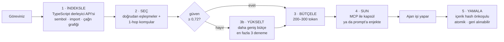

# Verðandi — AI Kodlama Ajanları için Bağlam Derleyicisi

[](https://github.com/natureco-official/verdandi/actions/workflows/ci.yml)
[](LICENSE)
[]()
[]()
[]()

**🇬🇧 [English version](README.md)**

> Ajanınız bütçesinin çoğunu problemi çözmeye harcamıyor.
> **Problemi aramaya** harcıyor.

**Verðandi** kod tabanınızı sizin ajanınız yerine okur. Projeyi TypeScript derleyicisiyle indeksler, görevin gerçekten dokunduğu sembolleri bulur ve ajana yalnızca onlardan oluşan küçük bir kapsül verir. Ajan arama aşamasını atlar, doğrudan işe başlar.



---

## Ölçüm

[`modelcontextprotocol/typescript-sdk`](https://github.com/modelcontextprotocol/typescript-sdk) deposundan alınmış commit çiftleriyle dokuz gerçek görev. Aynı model, aynı çaba ayarı, aynı görevler. Tek fark: ajan kendi bağlamını aramak zorunda mı, değil mi.

| Görev | Taban | Verðandi ile | Değişim | |
|---|---:|---:|---:|:--|
| T01 | 123.662 | 150.152 | **+%21,4** | `▓▓▓▓▓▓▓▓▓▓▓▓` |
| T07 | 632.596 | 451.486 | **−%28,6** | `▓▓▓▓▓▓▓▓░░░░` |
| T06 | 838.150 | 393.572 | **−%53,0** | `▓▓▓▓▓░░░░░░░` |
| T03 | 660.577 | 308.988 | **−%53,2** | `▓▓▓▓▓░░░░░░░` |
| T05 | 678.465 | 284.876 | **−%58,0** | `▓▓▓▓▓░░░░░░░` |
| T10 | 1.668.854 | 611.438 | **−%63,4** | `▓▓▓▓░░░░░░░░` |
| T02 | 2.197.039 | 569.752 | **−%74,1** | `▓▓▓░░░░░░░░░` |
| T08 | 2.224.703 | 284.683 | **−%87,2** | `▓▓░░░░░░░░░░` |
| T09 | 3.417.767 | 414.962 | **−%87,9** | `▓░░░░░░░░░░░` |
| **Toplam** | **12.441.813** | **3.469.909** | **−%72,1** | **3,59 kat az** |

Dokuz görevde **8.971.904 input token tasarruf** — aynı iş tamamlanırken 3,59 kat az input. Süre de düştü, görev grubuna göre %11 ile %55 arasında; ama faturada görünen sayı token.

> **T04 neden yok.** T04 ölçüldü (1.384.450 → 577.883) ama dışarıda bırakıldı: iki retry testi de sıra bağımlı çıktı ve izole koşumda **her iki tarafta da** düştü, yani hiçbir koşum düzeltmeyi kanıtlamadı. Testler sonradan onarıldı, token sayıları ise onarımdan önceye ait. Şunu da söyleyelim: bu çıkarma **bizim lehimize** çalışıyor — T04'ün −%58,3'ü ortalamanın altında, dahil edilseydi başlık −%70,7 olurdu. Sonuç geçersiz olduğu için dışarıda, işimize gelmediği için değil.

### T01 tabloda bilerek duruyor

T01, Verðandi ile **%21 daha pahalı**. İki satırlık bir import sırası düzeltmesi: aranacak bir şey yok, dolayısıyla kapsül saf ek yük.

Sonucun tamamı bu şekilde okunmalı. Verðandi modelleri ucuzlatmıyor — **aramayı** ortadan kaldırıyor. Kaldırılacak arama yoksa hiçbir şey kaldırmıyor ve denemenin bedelini size yazıyor. Büyük bir depoda dört dosyaya yayılmış bir hatada ise aramanın neredeyse tamamını kaldırıyor.

İşiniz T01'e benziyorsa buna ihtiyacınız yok. T08 veya T09'a benziyorsa fazlasıyla var.

### Henüz kanıtlanmamış olanlar

- **Kalite eşdeğerliği.** Görev testleri iki tarafta da geçiyor ve her koşum bağımsız olarak test edildi, lint'lendi, typecheck'ten geçirildi ve elle okundu — modelin kendi "doğruladım" beyanı hiçbir zaman kanıt sayılmadı. Ama üçüncü bir modelin **kör** karşılaştırma puanı hâlâ bekliyor. "Kalite kaybı yok" bir hedef, bitmiş bir ölçüm değil.
- **Genellenebilirlik.** Dokuz görev, tek depo, yalnızca TypeScript. T11–T40 ve ikinci bağımsız etiketleyici hâlâ açık.

Bunları yazıyoruz çünkü yalnızca kazandığını raporlayan bir benchmark, benchmark değildir.

---

## Problem, tek resimde

```
VERÐANDI OLMADAN                          VERÐANDI İLE
─────────────────────────────────         ─────────────────────────────────
 "auth retry hatasını düzelt"              "auth retry hatasını düzelt"
        │                                         │
        ▼                                         ▼
 ┌──────────────────────┐                  ┌──────────────────────┐
 │ ls, grep, cat        │  ← token         │ TS derleyici API'si  │  ← model
 │ dosya okur… yanlış   │  ← token         │ ile indeksleme       │    tokenı yok
 │ başka dosya okur…    │  ← token         └──────────┬───────────┘
 │ tekrar arar…         │  ← token                    │
 │ sonunda bulur        │  ← token                    ▼
 └──────────┬───────────┘                  ┌──────────────────────┐
            │                              │ kapsül: 3 sembol,    │
            ▼                              │ 2 dosya, ~250 token  │
      işe başlar                           └──────────┬───────────┘
                                                      │
                                                      ▼
                                                 işe başlar
```

Bu arama faturada görünmez. Yalnızca *"bu görev pahalıya patladı"* gibi görünür.

---

## Nasıl çalışır



Üç denemeden sonra güven hâlâ düşükse Verðandi durur ve görevi insana devreder; tahmine bütçe harcamaz.

---

## Hızlı başlangıç

```bash
git clone https://github.com/natureco-official/verdandi.git
cd verdandi
npm install && npm run build && npm test
```

Sonra kullanım biçimini seçin.

<details>
<summary><b>MCP sunucusu olarak</b> — yedi doğrulanmış ajan, artı denenmemiş Antigravity ve GLM (aşağıdaki tabloya bakın)</summary>

```bash
node bin/verdandi-context-compiler setup codex   # kayıt komutunu yazdırır
node bin/verdandi-context-compiler status
```

Stdio sunucusunu doğrudan başlatmak için `npm start`. Protokol uyumluluğu, sabitlenmiş resmî `@modelcontextprotocol/client@2.0.0` ile hem eski `initialize` hem 2026-07-28 `server/discover` akışında sürekli test edilir.
</details>

<details>
<summary><b>Prompt'a enjekte ederek</b> — MCP istemcisi gerekmez</summary>

```bash
./run_with_capsule.sh <ajan> <proje-kökü> "Göreviniz"
```

Desteklenenler: aşağıdaki tablodaki her ajan — `natureco`, `hermes`, `codex`, `claude`, `opencode`, `openclaw`, `kimi`, `glm` ve `antigravity`.
</details>

<details>
<summary><b>Bağımsız ajan olarak</b></summary>

```bash
verdandi-agent "Import sıralamasını düzelt" --project ./proje --model gpt-4o --api-key "$VERDANDI_API_KEY"
```

Ortam değişkenleri: `VERDANDI_API_KEY`, `VERDANDI_MODEL`, `VERDANDI_BASE_URL`, `VERDANDI_REQUEST_TIMEOUT_MS`, `VERDANDI_CODEX_MODEL`. Eski `URDR_*` adları da çalışır.
</details>

---

## Desteklenen ajanlar

Verðandi'yi kullanmanın birbirinden bağımsız iki yolu var ve her ajanda ikisi birden yok. Bu tablo hafızadan değil, gerçek dağıtım tablolarından çıkarıldı: [`bin/verdandi-context-compiler`](bin/verdandi-context-compiler) içindeki `AGENTS` ve [`run_with_capsule.sh`](run_with_capsule.sh) içindeki `case` bloğu.

| Ajan | MCP sunucusu | Kapsül enjeksiyonu | Kayıt | Yapılandırma dosyası |
|---|:--:|:--:|---|---|
| **Codex CLI** | ✅ | ✅ | tek komut | `~/.codex/config.toml` |
| **Claude Code** | ✅ | ✅ | tek komut | `~/.claude.json` |
| **NatureCo CLI** | ✅ | ✅ | tek komut | `~/.config/natureco/config.json` |
| **Hermes** | ✅ | ✅ | tek komut | `~/.hermes/config.json` |
| **OpenCode** | ✅ | ✅ | elle düzenleme | `~/.config/opencode/opencode.jsonc` |
| **OpenClaw** | ✅ | ✅ | elle düzenleme | `~/.openclaw/openclaw.json` |
| **Kimi CLI** | ✅ | ✅ | elle düzenleme | `~/.kimi-code/config.toml` |
| **Antigravity** | ⚠️ | ✅ | doğrulanmadı | `~/.gemini/antigravity-cli/mcp-config.json` |
| **GLM CLI** | ⚠️ | ✅ | doğrulanmadı | — |

> **Sütunun adı bilerek "kapsül enjeksiyonu", "prompt enjeksiyonu" değil.** Anlamı, Verðandi'nin
> kapsülü ajanın prompt'una yazması — bir yetenek, güvenlik terimi değil. Güvenlik sorusu aşağıda.

### Güvenmediğiniz kodda çalıştırmak

Verðandi'nin işi, indekslenen projenin **ham kaynağını** bir ajanın prompt'una koymaktır. O proje
sizin denetiminizde olmayan bir yerden geldiyse — çekilmiş bir bağımlılık, bir PR, bir dosyadaki
yorum satırı — içindeki metin ajana kelimesi kelimesine ulaşır ve ajan onu yapısı gereği sizin
talimatınızdan ayıramaz.

Bundan iki şey çıkıyor:

- `run_with_capsule.sh` artık `--yolo`, `--permission-mode auto` ve
  `--dangerously-skip-permissions` bayraklarını varsayılan olarak geçmiyor. Tam yetki açık bir
  tercih: `VERDANDI_YOLO=1 ./run_with_capsule.sh claude <kök> "<görev>"`. Bayraksız çalıştırmada
  ajanlar kendi normal izin davranışlarını uygular; etkileşimsiz kipte bu, reddedilen bir araç
  çağrısı demek olabilir — yarıda kalan görev, kimseye sorulmadan yapılan görevden iyidir.
- Gömülü kaynak veri olarak çerçeveleniyor: sınırlayıcılar içinde ve yalnızca `# Görev` bölümünün
  talimat olduğunu söyleyen açık bir cümleyle.

İkisi de garanti değil. Çerçeveleme modelin ayrımı yapmasına yardım eder, yapmaya zorlamaz. Yükü
taşıyan şey varsayılan: güvenilmeyen bir kod tabanında `VERDANDI_YOLO` olmadan çalıştırın ki ajanın
ikna edildiği her şey yine de kendi izin kapısından geçmek zorunda kalsın.

**Kusurlu iki satırı planınıza koymadan önce okuyun:**

- **Antigravity** artık kapsül enjeksiyonunu destekliyor: `run_with_capsule.sh antigravity`, `agy -p "<prompt>"` çağırıyor; `--dangerously-skip-permissions` yalnızca `VERDANDI_YOLO=1` ile ekleniyor. Doğrulanmamış olan taraf MCP — `setup antigravity` komutu `antigravity mcp add …` basıyor ama ikili dosyanın adı aslında `agy`, hiçbir resmî belge `mcp add` alt komutundan söz etmiyor ve yayınlanan yapılandırma yolları (`~/.gemini/config/mcp_config.json`, `.agents/mcp_config.json`) bu depodakiyle uyuşmuyor. Gerçek bir kurulumda doğrulanana kadar elle kaydetmek güvenilir yol.
- **GLM** aynı tarafta doğrulanmamış: kapsül enjeksiyonu çalışıyor, MCP çalışmıyor. `setup glm` komutu başına *"If GLM supports MCP:"* yazarak bir öneri basıyor ve tespit edilecek bir yapılandırma dosyası bildirmiyor, yani `status` da teyit edemiyor. GLM üzerinde MCP'yi desteklenen değil, denenmemiş sayın.

> **Windows'ta Antigravity:** **agy ≥ 1.0.15** gerekiyor. Daha eski sürümler bir borudan ya da alt süreçten çağrıldığında — betiğin yaptığı tam olarak bu — 0 ile çıkıp stdout'u sessizce atıyor, yani bozuk bir koşum "model hiçbir şey döndürmedi" gibi görünüyor ([antigravity-cli#76](https://github.com/google-antigravity/antigravity-cli/issues/76)). Betik sürümü kontrol edip uyarıyor, yarım gününüzü buna vermeyin.

`setup <ajan>` yapılandırmanızı kendisi düzenlemez, kayıt komutunu **yazdırır** — değişikliği olmadan önce görürsünüz. `status` ise gerçekte neyin kayıtlı olduğunu söyler.

> **−%72 hangi ajanda ölçüldü:** tüm benchmark koşumları **Codex CLI** ile yapıldı (`gpt-5.6-sol`, medium effort). Mekanizma ajandan bağımsız — kapsül sonuçta yalnızca daha küçük bir prompt — ama tasarruf tek bir ajanda *ölçüldü*. Başka ajanda aynı eğilimi bekleyin, aynı rakamları değil.

---

## Beş araç

| Araç | Ne yapar | Neden güvenli |
|---|---|---|
| `context_capsule` | Görev için sembol ve dosyaları seçer | Salt okunur, bütçe sınırlı |
| `read_symbol` | Sembolün kaynağını ve hash'lerini döndürür | Salt okunur, proje kapsamında |
| `apply_structured_patch` | Düzenlemeyi uygular | Dosya snapshot'tan beri değiştiyse reddeder |
| `rollback_patch` | Yamayı geri alır | Yalnızca proje içinde, yalnızca dokunulmamışsa |
| `validate_delta` | Proje scriptlerini çalıştırır | Yalnızca açık `commandProfile: "package-scripts"` ile |

---

## Güvenlik

Bu araç kaynağınızı okur, yama yazar ve paket scriptlerinizi çalıştırabilir. Bu, sözden fazlasını hak eder; her garantinin arkasında bir test var:

| Garanti | Nasıl sağlanıyor |
|---|---|
| Bayat indeksle yama yok | Kaynak snapshot'ı, dosya ve sembol başına içerik hash'i |
| Yarım uygulanmış çok dosyalı düzenleme yok | Tek atomik yama; herhangi bir hata tümünü geri alır |
| Projeden kaçış yok | Kök dışına çözümlenen yollar reddedilir — **symlink üzerinden dahil** |
| Sizin işinizin üzerine yazma yok | Geri alma, yamadan sonra değiştirdiğiniz dosyaları atlar |
| Sürpriz komut çalıştırma yok | `validate_delta` açık izin olmadan reddeder |
| Yalnızca onaylı scriptler | `test`, `lint`, `typecheck`, `build` — başkası yok |

Adversarial test paketi bilinçli olarak implementasyona **karşı** yazıldı: symlink kaçışları, bayat önbellek, çökme-güvenli journal manipülasyonu, MCP sınırı istismarı.

> **Windows:** iki symlink testi Geliştirici Modu ister. Açık değilse bu testler **gerekçesiyle atlanır**, başarısız olmaz — ama symlink korumaları o makinede doğrulanmamış olur. *Ayarlar → Sistem → Geliştiriciler için → Geliştirici Modu*.

### Kullanım kaydı

Yukarıdaki bütün ölçümler benchmark koşumlarından geliyor: seçilmiş görevler, temiz worktree'ler, tek depo. Bunlar sizin kod tabanınızda salı öğleden sonra neyin bozulduğu hakkında hiçbir şey söylemez. Bu yüzden sunucu yerel bir kayıt tutuyor; "kullandıkça düzelecek" iddiasının arkasındaki tek şey bu.

**Kaydettiği**, her araç çağrısı için: zaman damgası, araç adı, süre, sembol ve dosya sayısı, kapsül token boyutu, retrieval güveni, eskalasyon denemesi, görevin devredilip devredilmediği, belirtilen belirsizlik gerekçeleri ve çağrı düştüyse hata mesajı. Görev metni ve sembol adları **200 karaktere kırpılarak** yazılıyor, çünkü "hangi görevde ıskaladı" sorusu onlar olmadan cevaplanmıyor.

**Kaydetmediği**: kaynak kodu ve sembol gövdeleri. Makinenizden hiç çıkmıyor — içinde uç nokta, yükleme, ağ çağrısı yok.

```bash
node scripts/kullanim-ozeti.mjs        # hata oranı, devir oranı, düşük güvenli
                                       # çağrılar, tekrarlayan belirsizlik gerekçeleri
```

| | |
|---|---|
| Yeri | `.verdandi/usage.jsonl` (gitignore'da) |
| Taşımak | `VERDANDI_USAGE_LOG_PATH=/bir/yol.jsonl` |
| Kapatmak | `VERDANDI_USAGE_LOG=0` |

Kaydın düşmesi bir araç çağrısını asla bozamaz: her yazma sarmalanmış ve JSON-RPC kanalı olan stdout'a hiçbir şey yazılmıyor. İkisi de niyet değil, test. Kapalıyken dosyanın hiç oluşmadığı da öyle.

Test paketi kayıt kapalı koşuyor. Önceki hali öyle değildi ve `npm test` dosyayı sessizce kendi trafiğiyle dolduruyordu; test gürültüsüyle dolu bir kullanım kaydı sorulmaya değer hiçbir soruyu cevaplamaz.

---

## Geliştirme

```bash
npm run typecheck
npm run lint
npm test                                   # 111 test
node smoke_test.mjs                        # beş araç, canlı
node benchmark_runs/setup_worktrees.mjs    # benchmark worktree'lerini hazırlar
CAPSULE_WORKTREE_BASE="<yazdırılan yol>" npm run benchmark:retrieval
```

CI aynı kapıları **Linux, macOS ve Windows** üzerinde Node 20, 22 ve 24 ile çalıştırır; action sürümleri immutable commit SHA'larına sabitlenmiştir.

Windows matrise 28.07.2026'da eklendi. O güne dek yalnızca Linux ve macOS koşuyordu ve Windows'a özgü üç hata fark edilmemişti: `validate_delta` hiç çalışmıyordu, benchmark koşucusu her komutu "bulunamadı" sayıyordu ve dört test ortam farkından düşüyordu. **Bir platformda koşmayan test, o platformda olmayan testtir.**

---

## Retrieval kalitesi

Son bağımsız koşum (28.07.2026, dayanak `cc4b416`):

| Ölçüm | Sonuç | Eşik |
|---|---:|---:|
| Birincil dosya `hit@1` | %90,00 | ≥ %90 |
| Zorunlu dosya-grubu recall | %95,45 | ≥ %90 |
| Kabul edilebilir dosya precision | %50,91 | ≥ %50 |
| Sembol-grubu recall | %53,33 | ≥ %85 |

Sembol recall eşiğin altında ve sebebi retrieval gerilemesi değil: beklenen dört sembol (`signalProcessGroup`, `stopProcessGroup`, `trimHeaderOws`, `serializeProtocolDocument`) artık depoda yok. Dosyalar duruyor, semboller yeniden adlandırılmış.

Daha önceki bir koşum `hit@1` ve sembol recall için %100 raporlamıştı ama o sayılar **yeniden üretilemiyor** — dayandıkları commit'ler hiçbir yere kaydedilmemiş. Oracle bu yüzden artık her sonuca `baseCommit` ve `measuredAt` yazıyor. Ayrıntı: [`benchmark_runs/RETRIEVAL-QUALITY-2026-07-28.md`](benchmark_runs/RETRIEVAL-QUALITY-2026-07-28.md).

---

## NatureCo'dan diğerleri

- [**Urðr**](https://github.com/natureco-official/urdr) — AI kodlama ajanları için ağaç yapılı hafıza — `git diff` alabildiğiniz düz Markdown, vektör veritabanı yok
- [**Cupertino Terminal**](https://github.com/natureco-official/cupertino-terminal) — Windows, macOS ve Linux için macOS kalitesinde terminal — Rust çekirdek, Electron yok, uçtan uca şifreli P2P uzak kabuk dahil
- [**NatureCo CLI**](https://github.com/natureco-official/natureco-cli) — Terminalde yaşayan AI asistanı: sohbet, kod ajanı, otomasyon ve Telegram/Discord/Slack botları
- [**CodeDNA**](https://github.com/natureco-official/codedna) — Bir commit'in ne kadarını yapay zekâ yazdı ve yazarı onu gerçekten anlıyor mu?
- [**NatureCo SDK**](https://github.com/natureco-official/natureco-sdk) — NatureCo API için JavaScript SDK — AI sohbet botları kurun, her yere taşıyın

Urðr oturumlar arasında hatırlar. Verðandi **şu an** neyin önemli olduğuna karar verir. İkisi bilinçli olarak ayrı: Verðandi oturum geçmişi tutmaz ve büyük kod parçalarını saklamaz.

Mimari notlar ve ajan bazlı komutlar: [`UNIVERSAL.md`](UNIVERSAL.md) ve [`integrations/`](integrations/).

## Lisans

MIT — bkz. [LICENSE](LICENSE).

<sub>**NatureCo** ekosisteminin parçası — [natureco.me](https://natureco.me) · Part of the NatureCo ecosystem</sub>
